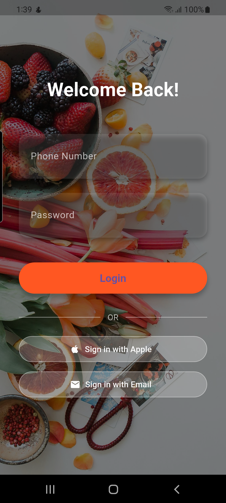
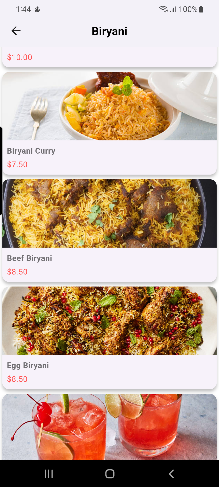
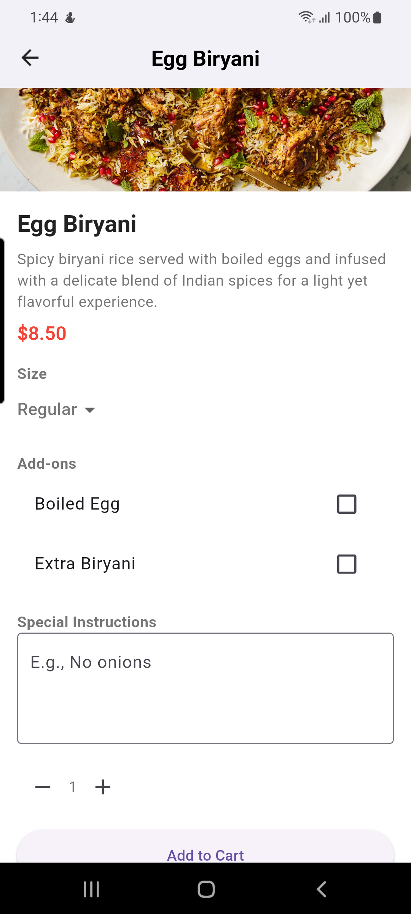
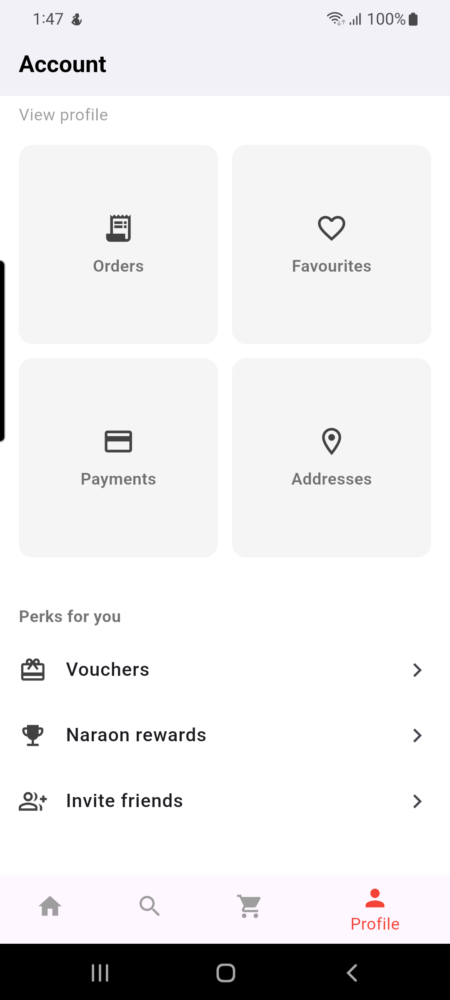
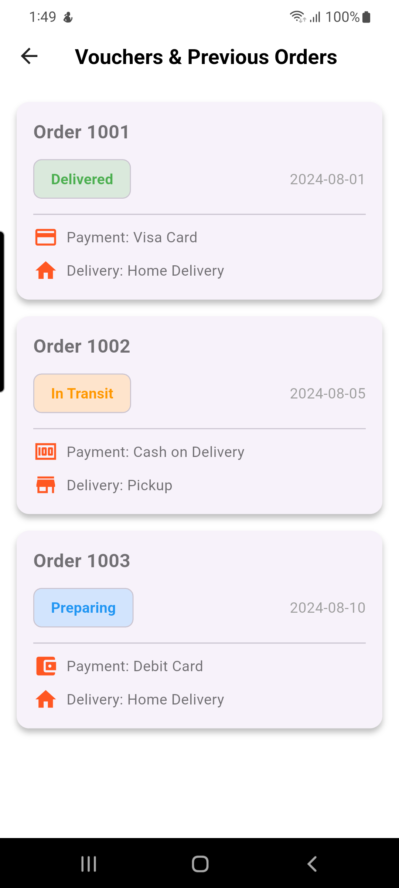
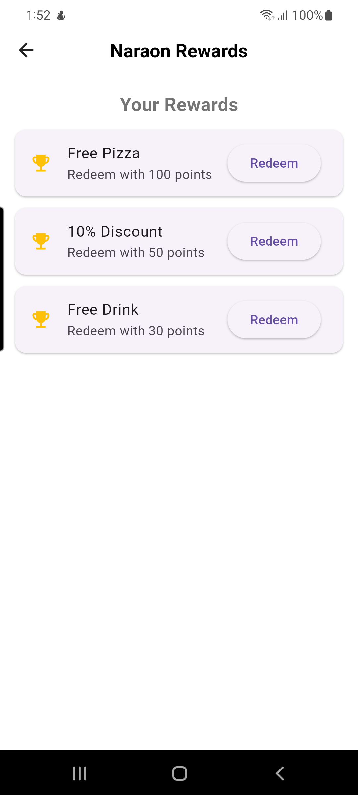
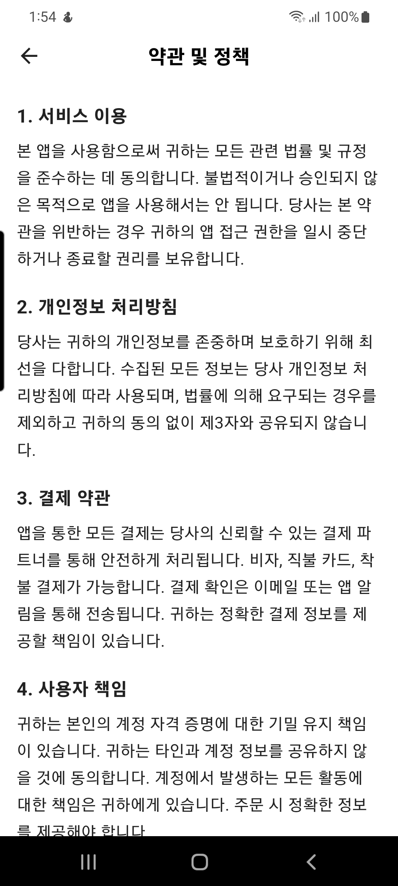

# Pizza APP

Welcome to Pizza APP, a user-friendly mobile application designed to bring your favorite pizzas and more right to your fingertips. This app offers a seamless experience to browse, select, and order delicious food with ease.

**Pizza APP**, Key Features:

Intuitive User Interface: Navigate effortlessly through categories, menus, and order details.

Wide Variety of Food Options: From classic pizzas to beverages and desserts, explore a diverse selection.

Personalized Recommendations: Get tailored food suggestions based on your preferences.

Smooth Order Management: Track your orders, payments, and delivery addresses all in one place.

Secure Authentication: Easy and safe login/logout for a personalized user experience.

Rewards & Referrals: Earn points and invite friends to enjoy exclusive discounts.

Help & Support: Access help center and terms & policies directly within the app.

Explore the screenshots below to get a glimpse of the app’s clean design and powerful features.

---

## Screenshots

<table>
  <tr>
    <td></td>
    <td></td>
    <td></td>
    <td></td>
  </tr>
  <tr>
    <td></td>
    <td></td>
    <td></td>
    <td></td>
  </tr>
  <tr>
    <td></td>
    <td></td>
    <td></td>
    <td></td>
  </tr>
  <tr>
    <td></td>
    <td></td>
    <td></td>
    <td></td>
  </tr>
</table>

---
